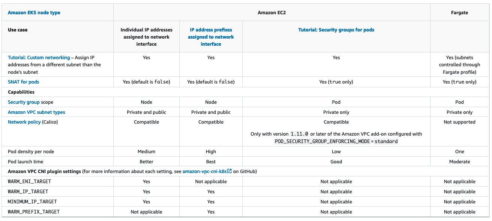

Handle Liveness/Readiness Probe failures¶

We advise increasing the liveness and readiness probe timeout values (default timeoutSeconds: 10) for EKS 1.20 an later clusters to prevent probe failures from causing your application's Pod to become stuck in a containerCreating state. This problem has been seen in data-intensive and batch-processing clusters. High CPU use causes aws-node probe health failures, leading to unfulfilled Pod CPU requests. In addition to modifying the probe timeout, ensure that the CPU resource requests (default CPU: 25m) for aws-node are correctly configured. We do not suggest updating the settings unless your node is having issues.

We highly encourage you to run sudo bash /opt/cni/bin/aws-cni-support.sh on a node while you engage Amazon EKS support. The script will assist in evaluating kubelet logs and memory utilization on the node. Please consider installing SSM Agent on Amazon EKS worker nodes to run the script.
Monitor IP Address Inventory¶

You can monitor the IP addresses inventory of subnets using CNI Metrics Helper.

    maximum number of ENIs the cluster can support
    number of ENIs already allocated
    number of IP addresses currently assigned to Pods
    total and maximum number of IP address available

You can also set CloudWatch alarms to get notified if a subnet is running out of IP addresses. Please visit EKS user guide for install instructions of CNI metrics helper. Make sure DISABLE_METRICS variable for VPC CNI is set to false.

Creating a metrics dashboard

After you have deployed the CNI metrics helper, you can view the CNI metrics in the Amazon CloudWatch console. This topic helps you to create a dashboard for viewing your cluster's CNI metrics.
To create a CNI metrics dashboard

    Open the CloudWatch console at https://console.aws.amazon.com/cloudwatch/

.

In the left navigation pane, choose Metrics and then select All metrics.

Choose the Graphed metrics tab.
Choose Add metrics using browse or query.
Make sure that under Metrics, you've selected the AWS Region for your cluster.
In the Search box, enter Kubernetes and then press Enter.
Select the metrics that you want to add to the dashboard.
At the upper right of the console, select Actions, and then Add to dashboard.
In the Select a dashboard section, choose Create new, enter a name for your dashboard, such as EKS-CNI-metrics, and then choose Create.
In the Widget type section, select Number.
In the Customize widget title section, enter a logical name for your dashboard title, such as EKS CNI metrics.

Choose Add to dashboard to finish. Now your CNI metrics are added to a dashboard that you can monitor. For more information about Amazon CloudWatch Logs metrics, see Using Amazon CloudWatch metrics in the Amazon CloudWatch User Guide.

